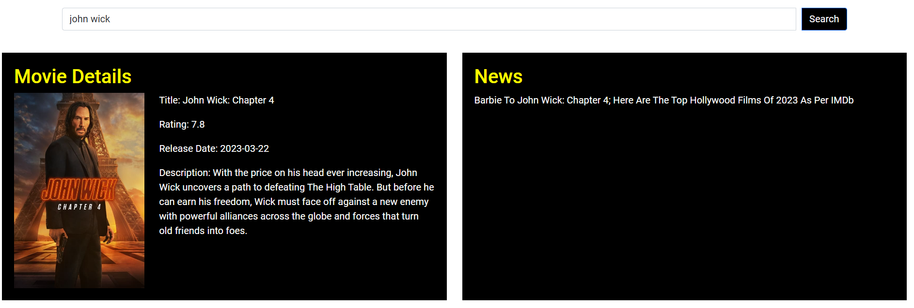
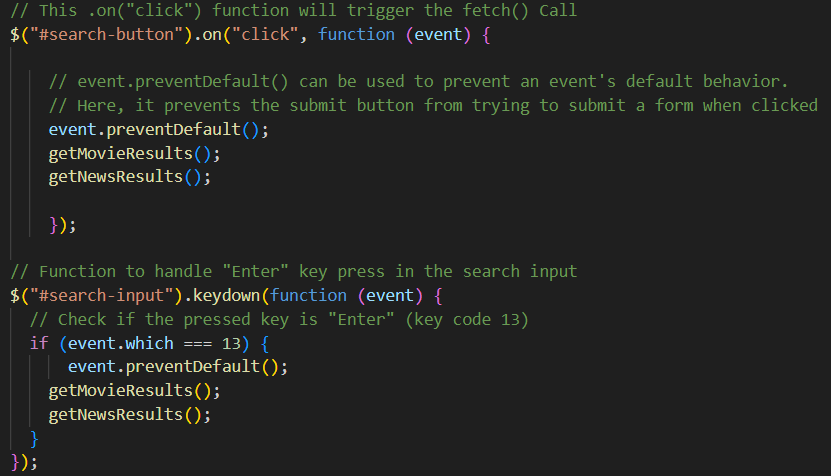
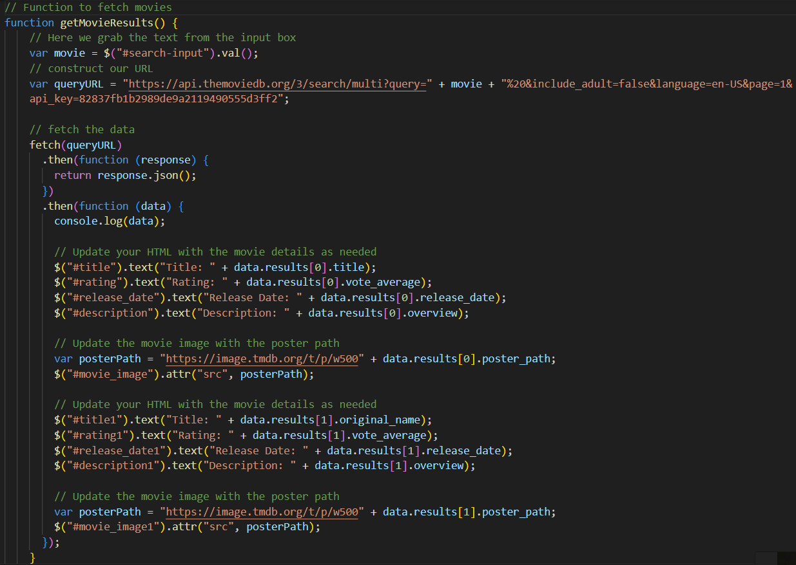
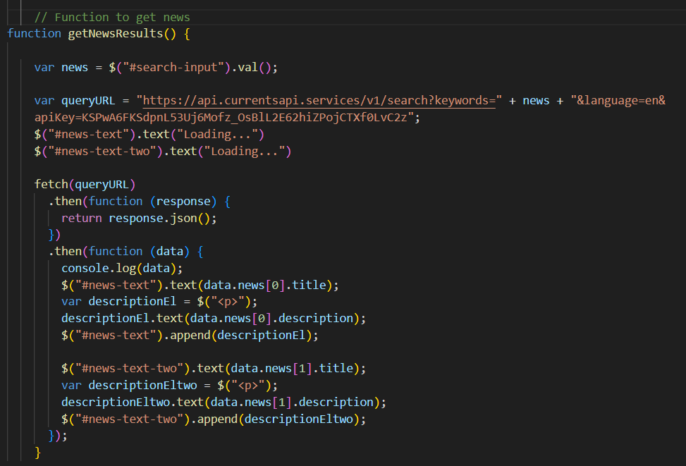

# What2Watch

Welcome to What2Watch – a web application that helps you discover and explore your favorite movies and TV series. Find out where to watch, get movie details, and stay updated with the latest news.

## Table of Contents

- [Introduction](#introduction)
- [Features](#features)
- [Getting Started](#getting-started)
- [Usage](#usage)
- [APIs Used](#apis-used)
- [Codes Used](#codes-used)
- [Contributing](#contributing)
- [License](#license)

## Introduction

What2Watch is a web application designed to provide users with a seamless experience in discovering and exploring movies and TV series. The application allows users to search for their favorite content, view details, and stay informed with the latest news.

## Features

- Search for movies and TV series.
- View detailed information about a selected movie or TV series.
- Stay updated with the latest movie neNavigate to the project directory:
- Responsive design for a great user experience on various devices.

## Getting Started

1. Clone the repository:

   ```bash
   git clone https://github.com/nonsoiwedinobi/what2watch.git
   ``````
2. Navigate to the project directory:
    ```
    cd what2watch
3. Open the index.html file in your preferred web browser.

## Usage

1. Open the application in your web browser.
2. Use the search bar to enter the title of the movie or TV series you want to explore.
3. Click the "Search" button or press "Enter" to initiate the search.
4. Explore detailed information about the selected content.
5. Stay informed with the latest movie news.



## APIs Used

- The Movie Database (TMDb) API
- Currents API

## Codes Used





## Contributing

- Paulina Zdunek
- Elehin Duale
- Nonso Iwedinobi

## License

This project is licensed under the [MIT License](LICENSE).
